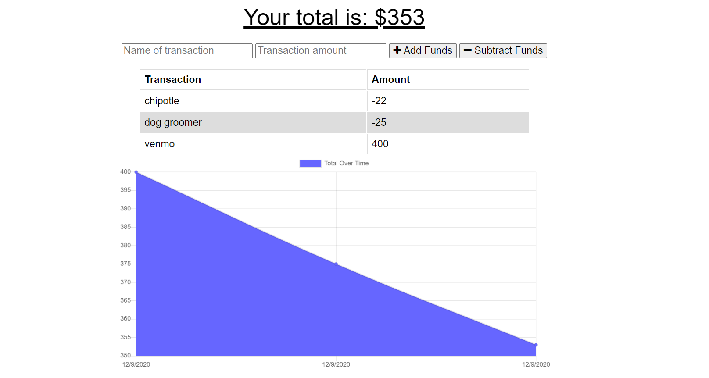

# PWA: Online/Offline Budget Trackers

## User Story
AS AN avid traveller
I WANT to be able to track my withdrawals and deposits with or without a data/internet connection
SO THAT my account balance is accurate when I am traveling

Description: The online/offline budget tracker app solves the real world problem of keeping track of your travel budget when you are without an internet connection. The app integrates a Mongo database, service worker, and webmanifest. The  motivation to build this project was to help clients achieve their budgeting goals by having an accessible website that is easy to navigate. Having offline functionality is paramount to our applications success.

Technologies used: HTML, CSS, JavaScript, MongoDB, Mongoose, service worker, Express, lite-server, morgan, compression. 

Challenges:  Setting up MongoDB Atlas. I had to recreate my account because of password confusion. 

Future development: Have more options than just adding or subtracting from the budget. Maybe have a section where you can automatically plan deposits for say paydays. Create a React.js front-end. 

Installation: clone repo and  'npm install' and 'node server.js'

Run: Using Chrome or a favorite browser copy link https://localhost:3000/ 

Deployed: https://infinite-hamlet-34719.herokuapp.com/ 

Authors and acknowledgment: Developed by Melanie Cisler

